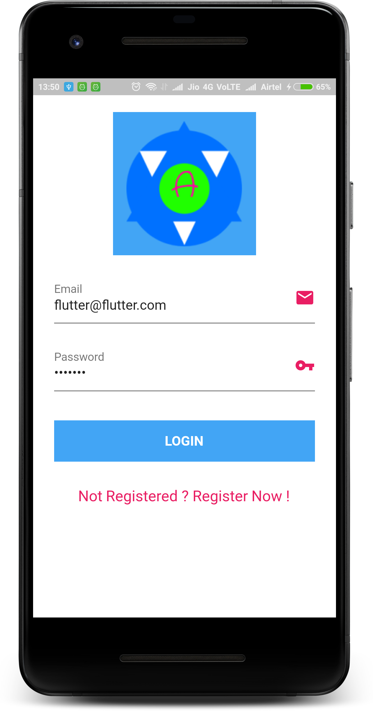
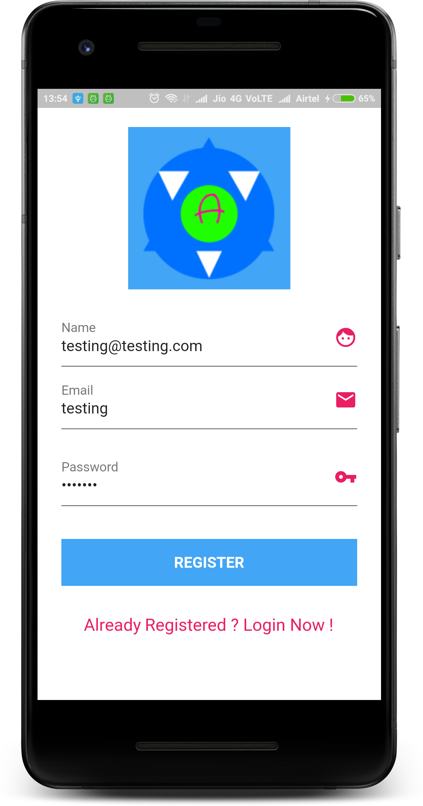
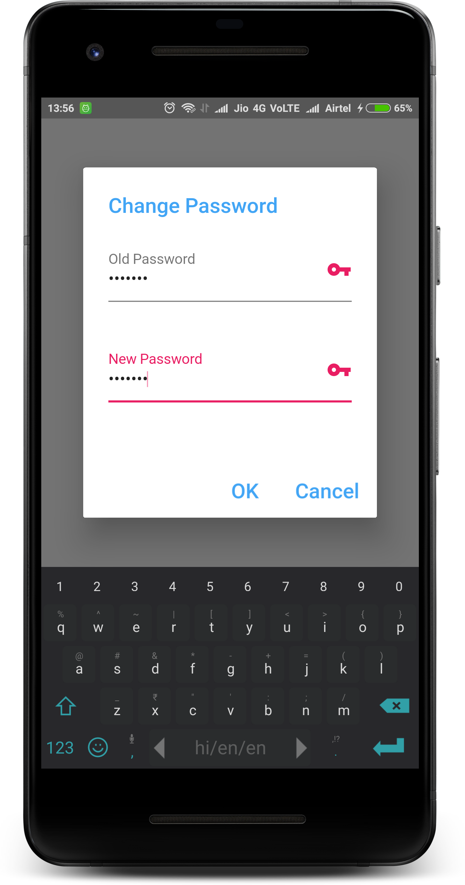

# flutter_client_php_backend

**App Demonstrating the use of Flutter and PHP.**

>- App Logo Created Using [Logo Maker](http://logomakr.com)
>- For Hosting used [Hostinger](https://www.hostinger.in/)

**How to use this App.**
>- Host the sample included inside [phpbackend](https://github.com/harsh159357/flutter_client_php_backend/tree/master/phpbackend) on preffered web hosting
>- Create a table inside your database using [FlutterClientPhpBackend.sql](https://github.com/harsh159357/flutter_client_php_backend/blob/master/phpbackend/FlutterClientPhpBackend.sql)
>- If you are using your own website just edit the following constant inside [constants.dart](https://github.com/harsh159357/flutter_client_php_backend/blob/master/lib/utils/constants.dart)

      static const String API_BASE_URL = "http://hafinse.pe.hu";

>- Make sure to edit [DBOperations.php](https://github.com/harsh159357/flutter_client_php_backend/blob/master/phpbackend/DBOperations.php) and change following things -

    private $host = 'your_host';
    private $user = 'your_user_name';
    private $db = 'your_database';
    private $pass = 'your_password';
>- Not Interested in doing above steps just clone this repo and use it as it is already hosted on Free Web Host Hostinger [hafinse](https://hafinse.pe.hu)

**Things Implemented**
>- Splash
>- Login
>- Registration
>- Change Password

**Screenshots**

 

License
-------

    Copyright 2018 Harsh Sharma

    Licensed under the Apache License, Version 2.0 (the "License");
    you may not use this file except in compliance with the License.
    You may obtain a copy of the License at

       http://www.apache.org/licenses/LICENSE-2.0

    Unless required by applicable law or agreed to in writing, software
    distributed under the License is distributed on an "AS IS" BASIS,
    WITHOUT WARRANTIES OR CONDITIONS OF ANY KIND, either express or implied.
    See the License for the specific language governing permissions and
    limitations under the License.
